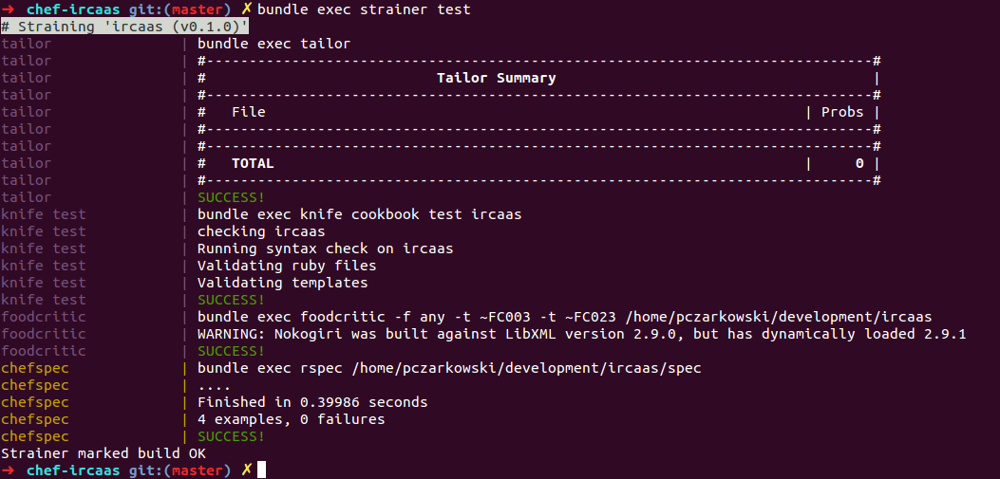

Day X - The Lazy SysAdmin's Guide to Test Driven Cookbooks
=====================================

This article assumes you have some knowledge of [Chef](http://www.opscode.com/chef/) and the [Berkshelf](http://berkshelf.com/) way of managing cookbooks.   If you do not,  then I highly recommend you watch the [Chefconf talk on 'The Berkshelf Way'](http://www.opscode.com/blog/chefconf-talks/the-berkshelf-way-jamie-winsor/) before reading further.

What even is ?
----------------------


Test driven development (TDD) has been around for a long time and is heavily embraced in the Ruby developer community.   The basic idea of it is to provide feedback to the developer as early as possibly as to whether their code is working via unit tests.   In TDD the person writing the code often writes the [failing] unit test first, and then writes the code to make that test pass.   There is also the concept of README Driven Development which is where you write the documentation even before that.

This article explores some tooling such as `chefspec`, `foodcritic` and `strainer` to bring this style of testing to chef cookbooks.   This method of writing cookbooks can feel very awkward at first,  and `chefspec` especially can take a while to get the hang of it.   We'll explore a few ways to help make that transition.

The tools that I am using were decided for me by the [stackforge chef cookbooks](https://launchpad.net/openstack-chef) which already had a unit-testing framework defined when I started working with them.   There are likely other tools out there that do similar things ( e.g. bats vs minitest vs chefspec ) so do not feel constrained by the tools I talk about,  instead focus on the ideas.

It's important to mention here that this is not an inflexible framework and if you want to write the code, then the tests, then documentation that's fine as well,  and in fact that's how I started off and as I got more comfortable with the ideas and tools I slowly moved to mostly following the workflow of Documentation -> Test -> Code,  but there are many times where I write some prototype code first then go back and document/test.

README Driven Development (RDD)
------------------------------------------------------

Every chef cookbook should have a `README.md` file in its root that acts as the documentation for it.   This should be the first place your start, and by happy chance if you create a new cookbook with Berkshelf `berks cookbook new_cookbook` it will create a very servicable skeleton `README.md` file for you to use.    I use a different format which you'll see later but that's just personal preference.

You should start by adding your details to the `LICENSE` file, and copy/paste the appropriate license snippet into it ( I usually Apache 2.0 license ).   It's very important to let others know what license you're releasing the cookbook under,  some companies have policies against using specific licenses ( or no license data ) for legal protection.

Next you should start filling out the `README.md`.  I have an Rails app that uses sqlite3 for the development environment so my cookbook may start off having just a single recipe ( not counting default ) called `application`.  There are some obvious dependencies and attributes to set,  so I'll document those at this point as well.

Obviously you won't know beforehand about every tiny detail,  so start with broad strokes and then update it as you go.   For instance my application talks to [docker](http://docker.io),  but I'll add that support into the cookbook after I've got my base application installed, so I'll wait until I'm about to implement that before I write the documentation for it.

### README.md ###
```
Requirements
=========

Chef 0.11.0 or higher required (for Chef environment use).

Cookbooks
----------------

The following cookbooks are dependencies:
* ruby
* git

Recipes
=====

ircaas::application
---------------------------

* creates user `ircaas`
* includes recipes `git::default`, `ruby::default`
* Install IRCaaS Application code from `https://github.com/paulczar/ircaas`

Attributes
======

ircaas['user']  - user to run application as
ircaas['git']['repo']  - repo containing IRCaaS code
ircaas['git']['branch'] - Branch to download
```

The final file to edit as part of RDD is `metadata.rb` which has optional methods to document recipes, attributes, etc as well.  I try not to double up this information,  so unless it is actually needed for the cookbook to run ( such as dependencies )  I leave them out.    It's fine If you prefer to add it in both locations,  or prefer to document in the metadata file,  simply state 'see metatadata.rb under the appropriate sections.' in the `README.md`.

### metadata.rb ###
```
name             'ircaas'
maintainer       'Paul Czarkowski'
maintainer_email 'username.taken@gmail.com'
license          'All rights reserved'
description      'Installs/Configures ircaas'
long_description IO.read(File.join(File.dirname(__FILE__), 'README.md'))
version          '0.1.0'

%w{ ubuntu }.each do |os|
  supports os
end

%w{ ruby git }.each do |dep|
  depends dep
end
```

Test Driven Development (TDD)
===================

Now that we've documented our first stage of the cookbook we want to write some tests for it,  but first we need to set up the tooling.   Most of the tools in the testing framework that we're installing are rubygems and can quickly suck you into dependency hell.  To help deal with that and provide myself with some consistency I have created a Git repository called [meez](https://github.com/paulczar/meez) that contains my (very opinionated, and still very much under development) skeleton cookbook and has a `Gemfile` and `Gemfile.lock` to help deal with the dependencies.  I also have base `Berksfile`, `Vagrantfile`, `Strainerfile` and I use `Ruby 1.9.3` as my default ruby environment.

With that skeleton in place I can get up to speed very quickly by cloning the repo and running `bundler`.

```
git clone https://github.com/paulczar/meez.git chef-ircaas
cd chef-ircaas
bundle install
```

### [Strainer](https://github.com/customink/strainer) ###

A framework for testing chef cookbooks.   It doesn't perform any tests itself,  but instead calls a series of tools which are listed in a `Strainerfile`.

#### Strainerfile ####

```
# Strainerfile
tailor: bundle exec tailor
knife test: bundle exec knife cookbook test $COOKBOOK
foodcritic: bundle exec foodcritic -f any -t $SANDBOX/$COOKBOOK
chefspec: bundle exec rspec $SANDBOX/$COOKBOOK/spec
```

### [Tailor](http://wiki.github.com/turboladen/tailor) ###

Tailor reads Ruby files and measures them against some common ruby style guides.  This is the tool that I'm least familiar with out of the set,  but the framework I 'borrowed' from the stackforge cookbooks included it and I saw no reason to remove it.

### knife test ###

tests cookbook for syntax errors. this uses the built-in ruby syntax checking option for files in the cookbook ending in
.rb, and the erb syntax check for files ending in .erb (templates).   This comes free with `knife`.

### [foodcritic](http://acrmp.github.io/foodcritic/) ###

Foodcritic is a linting tool for chef cookbooks.  It parses your cookbook and comments on your styling as well as flagging known problems that would cause chef to break when converging.  There is an excellent library of errors and Foodcritic will kindly provide an error code and often will even tell you how to fix it. 

**Example:** [FC002: Avoid string interpolation where not required](http://acrmp.github.io/foodcritic/#FC002)

### [rubocop](https://github.com/bbatsov/rubocop) ###

I have just recently added this to my testing framework.   It is a very verbose lint / style parser for Ruby.  Prepare for it to yell at you a bunch when you start using it.

### [guard](http://guardgem.org/) ###

I'm not using this yet,  but it's a tool that watches files for changes and then runs commands against those files.  This will allow for real time feedback of changes to files.   Some potential uses for this that I plan to investigate are:

* watch `Berksfile` and `metadata.rb` to automatically download any new cookbook dependencies.
* watch `Gemfile` to automatically install any new Gem dependencies.
* watch `*.rb` files to automatically check syntax/linting.


### [chefspec](http://sethvargo.com/chefspec/) ###

ChefSpec is a unit testing framework for Chef cookbooks.   It is an extension of `RSpec` and the version I use ( `ChefSpec 3.x` ) requires `Ruby 1.9+` and `Chef 11+`.

ChefSpec runs your cookbook locally with `Chef Solo` but doesn't actually converge.  This means it's very fast and it doesn't mess up your system by actually installing packages or pushing templates.  Chefspec uses (Fauxhai)[https://github.com/customink/fauxhai] to mock Ohai data, and thus the unit tests don't need to be run on the same Operating System as your dev or production servers.

Unit Tests
---------------

You'll be writing all of your unit tests in Chefspec,  the other tools mostly take care of themselves and don't require much ( except for maybe if you want to exclude some specific checks in them ) care and feeding.   Tests belong in the `spec/` directory of your cookbook and by convention we have a spec per recipe named `<recipe-name>_spec.rb`.   So in our application example we would have the file `spec/application_spec.rb`.   There is also a `spec/spec_helper.rb` which calls the `chefspec` modules and sets any common settings or Ohai data.  

The basic workflow of Chefspec is that you describe what you're testing in a `describe` block which includes the call to run the fake chef run and sets any options or node attributes to be set before running any tests inside the block.    Tests are written as `it` blocks and are simply pseudocode explaining what the function you're testing should do followed by the result that you expect to see from a successful run of that function.  The testable resources are very well [documented](https://github.com/sethvargo/chefspec/tree/master/examples).

I know that my application recipe will need to include some recipes, create a user, and clone a git repository,  so my spec file will look like this : 

#### spec/application_spec.rb ####

```
require_relative 'spec_helper'

describe 'ircaas::application' do 
    before do   # This block defines what is run before each test.
      @chef_run = ::ChefSpec::Runner.new ::UBUNTU_OPTS do |node|   # Creates chef_run object from the Runner object.
        node.set['ircaas'] = {       # Sets custom node attributes
          user: 'ircaas',                 # so that we don't fail just because somebody went in
          path: '/opt/ircaas',          # and changed a value in the default attributes file.
          git: { repo: 'ssh://git.path', branch: 'master' }
        }
      end
      @chef_run.converge 'ircaas::application'  # Fake converges the recipe.
    end

    it 'includes ruby::default recipe' do
      expect(@chef_run).to include_recipe 'ruby::default'
    end

    it 'includes git::default recipe' do
      expect(@chef_run).to include_recipe 'git::default'
    end

    it 'creates ircaas user' do
      expect(@chef_run).to create_user('ircaas')
    end

    it 'checkouts ircaas from repo' do
      expect(@chef_run).to checkout_git("/opt/ircaas").with(repository: 'ssh://git.path', branch: 'master')
    end

# a test without an expect will be marked as pending, useful if you don't know how to test a 
# specific function,  or you want to write the test later.
    it 'an example to help show pending tests'      

end
```

Now that we've written the tests we can write the recipe to pass the them.

#### recipe/application.rb ####

```
# Cookbook Name:: ircaas
# Recipe:: application

include_recipe 'ruby::default'
include_recipe 'git::default'

user node['ircaas']['user'] do
  username  node['ircaas']['user']
  comment   "ircaas User"
  shell     "/bin/bash"
  home      "/home/ircaas"
  system    true
end

git node['ircaas']['path'] do
  repository  node['ircaas']['git']['repo']
  branch      node['ircaas']['git']['branch']
  destination node['ircaas']['path']
  action      :checkout
end
```

Finally we run the tests!

```
bundle exec berks install # only run when you change a cookbook dependency.
bundle exec strainer test
```



Integration Test
-----------------

At some point we'll want to make sure that the whole cookbook functions correctly and will result in a node configured and working as defined in your cookbook.   To perform an Integration Test we use `Vagrant`,  for which I have a base `Vagrantfile` in my `meez repo`.   I won't bore you with too much details because chances are you're already familiar with Vagrant.   Needless to say you want to run `vagrant up` and then after it completes provisioning you'll want to SSH into it and test that the node looks correct.

Summary
--------------

We've explored the basics of doing README/Test Driven Development for Chef Cookbooks.   This has been a very shallow look at a very deep topic so I encourage you to look around at other tools and frameworks and try to find something that works for you.    It took me quite some time to really grok the whole process and then longer again to be able to proudly declare that I'm somewhat competent at it.  

If at first chefspec is really hard just write pending tests for everything, or skip it altogether.  The rest of the tests provided by Strainer will still help catch issues without having to actually converge a node.   

One of the unexpected advantages I've found when following this framework is that there are two places I really have to think about what I want to acheive before I even write a single line of a recipe ( Readme, and Spec files).  This gives me time to really formulate in my head what it is I need to do and have already started breaking it down into small easy chunks that can be written between coffee breaks when it comes time to actually write code.

### Further reading ###

* Presentation - TDDing tmux
* * [slides](https://speakerdeck.com/sethvargo/tdding-tmux)
* * [video](http://www.youtube.com/watch?v=ZC91gZv-Uao)
* Presentation - [TDD for Ops](http://cwebberops.github.io/scale11x-tdd_for_ops/#/)
* Presentation - Test Driven Development for Chef Practictioners
* * [slides](http://www.slideshare.net/jimhopp/testdriven-development-for-chef-practitioners)
* * [video](http://www.youtube.com/watch?v=o2e0aZUAVGw)
* Book -  [Test-Driven Infrastructure with Chef](http://shop.oreilly.com/product/0636920030973.do)
